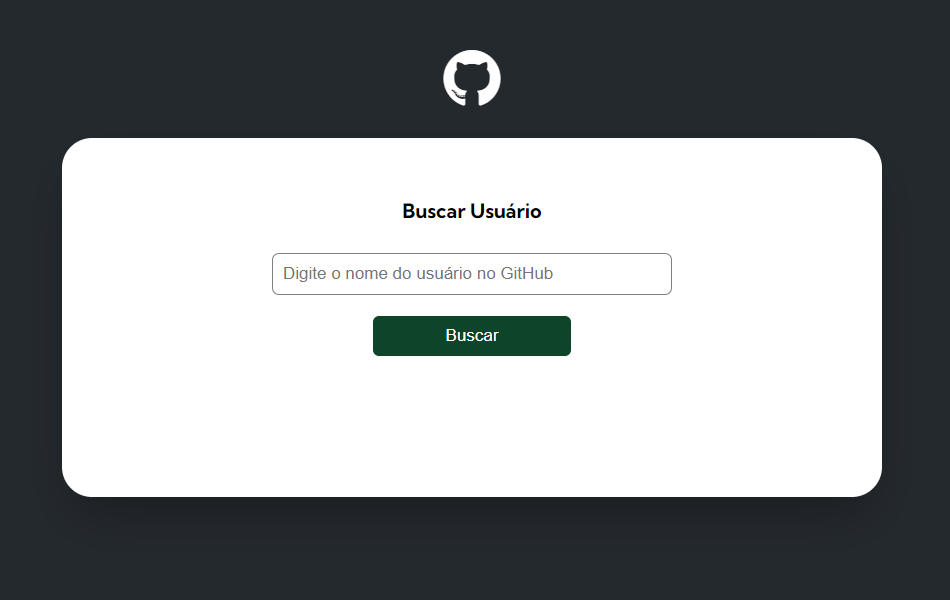

# GitHub-API--Profile.Search

## Table of contents

- [Overview](#overview)
  - [Screenshot](#screenshot)
  - [Links](#links)
- [My process](#my-process)
  - [Built with](#built-with)
  - [What I learned](#what-i-learned)
- [Author](#author)

## Overview

### Screenshot



### Links

(OBS: ctrl + click ⬇️)
- Live Site URL: [Click-me](https://gugas1lva.github.io/GitHub-API_Profile.Search/)

## My process

### Built with

- Semantic HTML5 markup
- CSS custom properties
- Flexbox
- CSS Grid
- Mobile-first workflow

### What I learned

I honed my skills by consuming APIs, importing and exporting modules, creating validations and ordering functions.
I improved my ability to organize tasks with multiple refactorings in my code. The division of responsibilities was one of the most valuable things I improved when building this project.

```html
<h1>...</h1>
```
```css
.loremClass{
  propiety: 'value'
}
```
```js
const loremFunction = () => {
  console.log('🎉')
}
```

## Author

- LinkedIn - [@GustavoSilva](https://www.linkedin.com/in/guga-silva-124706233/)
- GitHub - [@GugaS1lva](https://github.com/GugaS1lva)
- Instagram - [@50repolhoscozidos](https://www.instagram.com/50repolhoscozidos/)
- Email - [contatogustavosilva017@outlook.com](mailto:contatogustavosilva017@outlook.com)
- Frontend Mentor - [@GugaS1lva](https://www.frontendmentor.io/profile/GugaS1lva)
